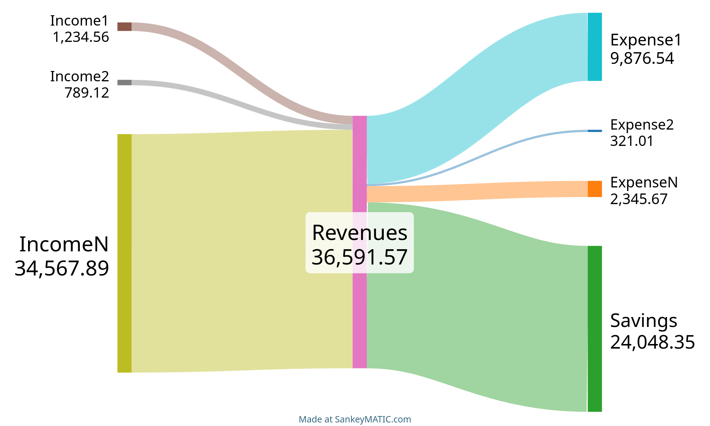

# balance-parser

Script to parse reports generated by [Ivy Wallet](https://github.com/Ivy-Apps/ivy-wallet) and generate a Sankey diagram to visualize revenues and expenses.
The script also generates a report in the format accepted by [SankeyMATIC](https://sankeymatic.com/).

After the execution a new window will be opened in the browser with the generated diagram.

Alternatively, the output in the following format can be pasted to SankeyMATIC to create the graph from there:

```
Income1 [1234.56] Revenues
Income2 [789.12] Revenues
IncomeN [34567.89] Revenues

Revenues [9876.54] Expense1
Revenues [321.01] Expense2
Revenues [2345.67] ExpenseN
Revenues [24048.35] Savings
```


